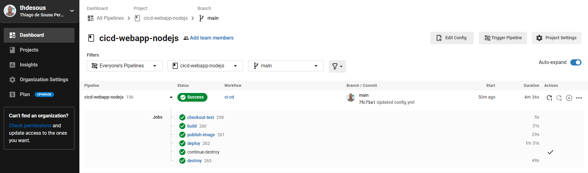

# Projeto de automação de infraestrutura
> **README.md em construção !!!** 

Mussum Ipsum, cacilds vidis litro abertis. A ordem dos tratores não altera o pão duris.Todo mundo vê os porris que eu tomo, mas ninguém vê os tombis que eu levo!

## Visao do Projeto
Mussum Ipsum, cacilds vidis litro abertis. Mauris nec dolor in eros commodo tempor. Aenean aliquam molestie leo, vitae iaculis nisl. 

* Webapp - http://ip:3000/

## Ferramentas utilizadas
* Git - Sistema de controle de versão
* Github - Plataforma de hospedagem de código-fonte 
* Circleci - Plataforma de CI/CD
* Docker - Containers
* Dockerhub - Provedor de imagens de containers
* Node.js - JavaScript runtime
* Terraform - Infrastructure as Code (IaC)
* Azure - Cloud Provider
  * Container Instances
  * Storage Accounts (Containers)

## Webapp
Mussum Ipsum, cacilds vidis litro abertis. Viva Forevis aptent taciti sociosqu ad litora torquent.Admodum accumsan disputationi eu sit. Vide electram sadipscing et pe

## Circleci
CI/CD platform 

### Projeto 
Mussum Ipsum, cacilds vidis litro abertis. Suco de cevadiss, é um leite divinis, qui tem lupuliz, matis, aguis e fermentis.Suco de cevadiss deixa as pessoas mais interessantis

* Jobs/Workflows
  - checkout-test
  - build
  - publish-image
  - deploy
  - continue-destroy
  - destroy

### Variáveis de ambiente
Mussum Ipsum, cacilds vidis litro abertis. Mé faiz elementum girarzis, nisi eros vermeio.Paisis, filhis, espiritis santis.Viva Forevis aptent taciti sociosqu ad litora torquent.

